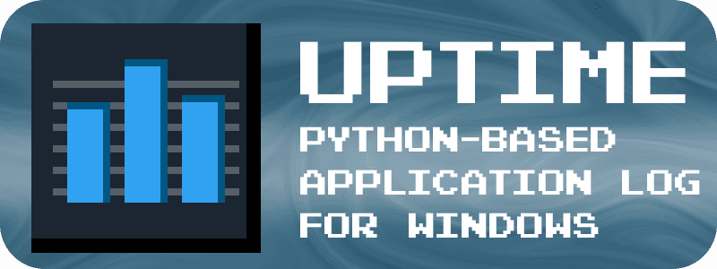
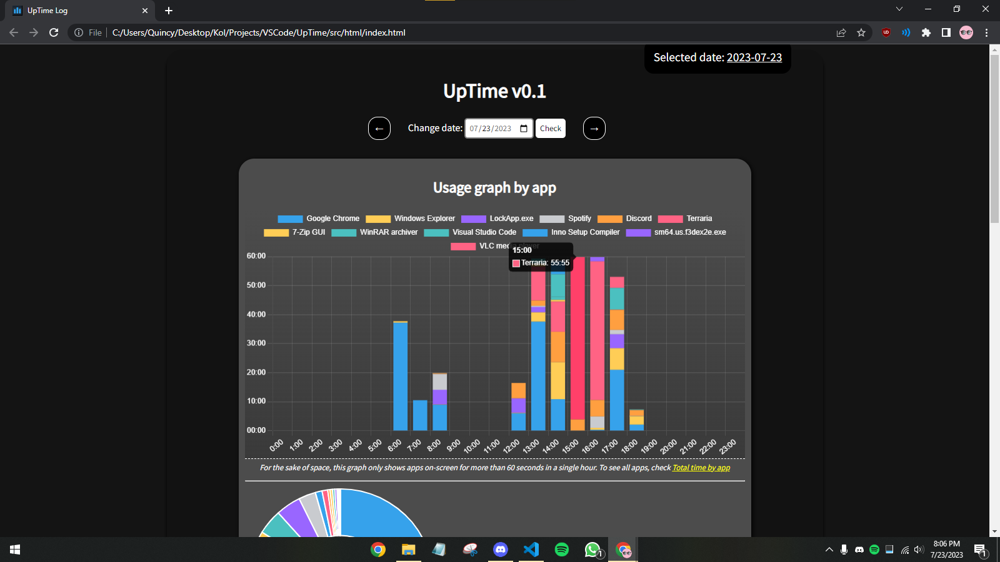
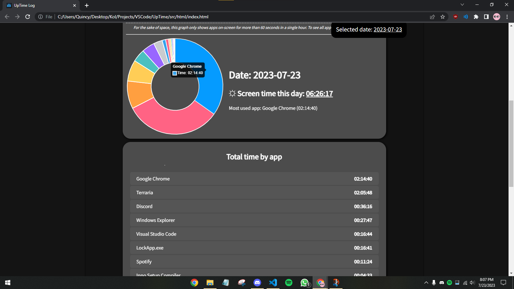

## UpTime - An application log for Windows

UpTime is an open-source python app (and static site) that logs how long you spend on different apps, based on your active window. You can view how much time you spend on each app in an HTML file, using log information that is updated every minute, with graphs, and precise times for each app, on each day it logs.

## Installation

- Download the release 
- Extract the .zip to your desired folder
- Run `UpTime/UpTime.exe` (the python logger), keep in mind the app will run silently, with no indication but a process in task manager. *If you want this logger to run at startup: create a shortcut for `UpTime.exe`, press `Win + R` and type `shell:startup` which will open the startup folder, place the shortcut you created in the startup folder.*
- Open `UpTime/html/index.html` to check the data logged. You should probably make a shortcut somewhere convenient for `index.html`. *make sure you have run `uptime.exe` for at least 1 minute to see the html in action.* 

## Screenshots

## Limitations

- Any windows store app will be logged as 'Application Frame Host', so, different windows store apps will be logged as the same app.
- The tracking may miss a few seconds on an app you're tracking *(probably since this app does not use threading)*

## Acknowledgements

- In order for the application to be fully functional offline, I include the [chart.js](https://www.chartjs.org/) library locally.
- UpTime was made by [Quincy](https://github.com/quincanny)
- UpTime was created as a final project for [CS50x](https://cs50.harvard.edu/x/)

